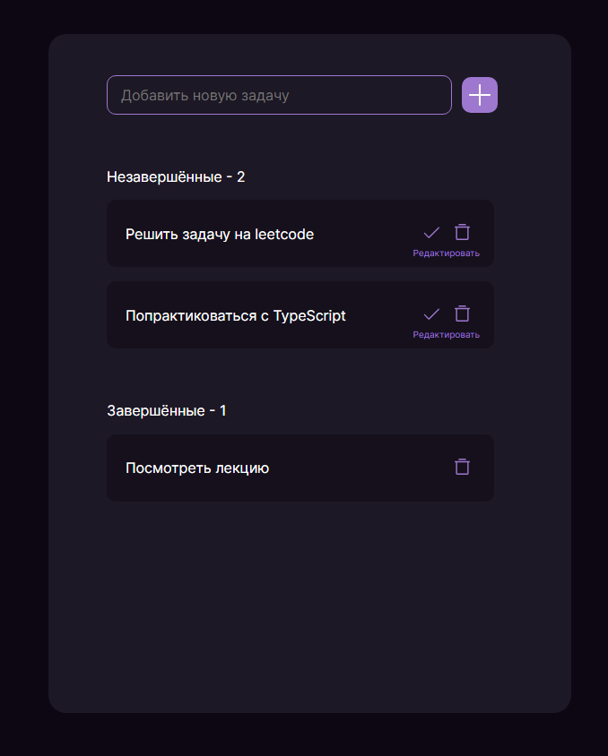

# Учебный проект "To-Do"

<h2>Описание проекта</h2>
Это простое веб-приложение для управления списком задач (To-Do List). Приложение позволяет пользователям добавлять, редактировать, удалять и отмечать задачи как выполненные. Задачи сохраняются в localStorage браузера, чтобы данные сохранялись между сессиями.
<h2>✨ Функциональность:</h2>
<ul>
<li>Добавление задачи: Пользователь может ввести название задачи и добавить её в список незавершённых задач.</li>
<li>Редактирование задачи: Пользователь может редактировать название существующей задачи.</li>
<li>Удаление задачи: Пользователь может удалить задачу из списка.</li>
<li>Отметка задачи как выполненной: Пользователь может отметить задачу как выполненную, после чего она перемещается в список завершённых задач.</li>
<li>Счётчики задач: Отображаются счётчики для завершённых и незавершённых задач.</li>
</ul>
<h2><a href="https://pixso.net/app/editor/ydPcLc-k5SzCDUM9AUkizg?icon_type=1&page-id=0%3A1&editMode=coder" target="_blank" rel="noreferrer noopener"><ya-tr-span data-index="31-0" data-translated="true" data-source-lang="en" data-target-lang="ru" data-value="Design" data-translation="Дизайн" data-ch="0" data-type="trSpan" style="visibility: initial !important;" data-selected="false">Дизайн</ya-tr-span></a></h2>

## Стек технологий:

<ul>
<li>HTML5: Используется для структуры веб-страницы.</li>
<li>CSS3: Используется для стилизации приложения.</li>
<li>TypeScript: Используется для написания логики приложения, обеспечивает строгую типизацию и предотвращает ошибки.</li>
<li>UUID: Используется для генерации уникальных идентификаторов для каждой задачи.</li>
<li>localStorage: Используется для сохранения задач в браузере.</li>
</ul>

## Установка и запуск проекта:

Клонировать репозиторий:

    git clone git@github.com:opigon1/To-Do-App.git

Перейдите в директорию проекта:

    cd todo-list-app

Установить зависимости:

    npm install

Запустите проект:

    npm start

